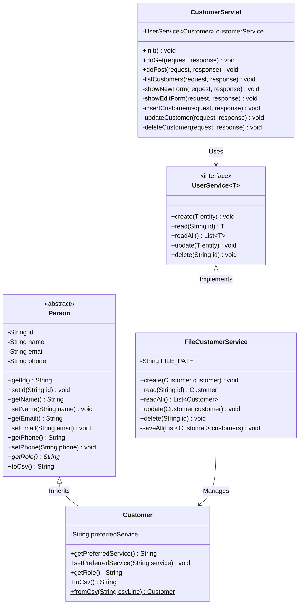

# SE1020 – Object Oriented Programing
## Final Report: Online Saloon Management System

### Project Overview
Developed a web-based "Online Saloon Management System" to fulfill the assignment requirements. The application is built using Java Web Technologies (Servlets, JSP) in IntelliJ IDEA. The system persists data to text files to meet the file read/write operational requirement. The frontend is elegantly styled using modern Tailwind CSS.

### Implemented Requirements
1. **Object-Oriented Programming (OOP):**
   - **Encapsulation:** Implemented in `Person` and `Customer` classes using private fields and public getters/setters.
   - **Inheritance:** `Customer` inherits from the abstract `Person` class, inheriting core properties (id, name, email, phone) while extending them with specific behavior (preferredService).
   - **Polymorphism:** The `toCsv()` method is overridden in the `Customer` class. The system uses a `UserService<Customer>` interface to decouple the controller from the concrete File storage logic.
2. **File Handling (CRUD):** 
   - A generic read/write implementation via `FileCustomerService.java` manages records within `customers.txt`. It supports Create, Read (All and Specific), Update, and Delete.
3. **Frontend & UI:**
   - 4 JSP screens established: `index.jsp` (Welcome), `register.jsp` (Create), `users.jsp` (Read, Delete, Search), `update.jsp` (Update).
   - Tailwind CSS used for a clean, professional finish.

---

### Class Diagram

---

### Git Commit History

*The commit log can be viewed by executing `git log` in the project directory.*

*End of Report*
